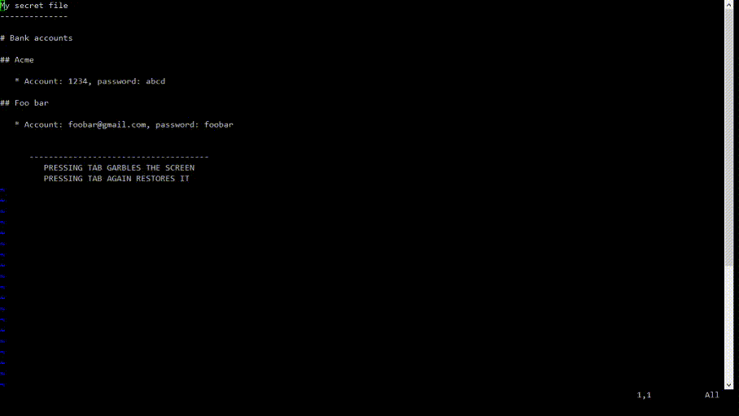

# gvim-garble

Garble gvim display for sensitive files without modifying file contents. Works
by changing the font to a mangled one.

# Demo

# Install and Usage

	* Install the font/bars.ttf font
		** Developed with fontforge, check font/bars.sfd for the fontforge project file
	* Copy plugin/garble.vim to your VIM plugin directory. Edit the file to
	  change font size or mapped character (`TAB` by default).
	* Open a file, press `TAB` to garble the contents and `TAB` again to get it back
	
